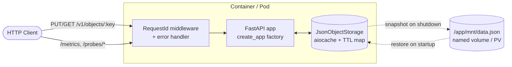

# JSON Object Storage Service

A small, production-styled HTTP service for storing JSON objects in memory with optional TTL, designed to run in Kubernetes. State survives pod restarts via an on-disk snapshot taken at shutdown and restored at startup.


## Features

- `PUT /v1/objects/{key}` / `GET /v1/objects/{key}` — write/read JSON with optional `expires` header (TTL in seconds)
- Configurable payload limit — oversized bodies are rejected with `413 Content Too Large`
- Unified error envelope — every error response is `{"error": {"code", "message", "request_id"}}`
- Per-request `X-Request-ID` (inbound or generated UUID) is bound into every structlog line and echoed on the response
- Liveness / readiness probes for Kubernetes (`/probes/liveness`, `/probes/readiness`)
- Prometheus metrics (`/metrics`, gated by the `enable_metrics` setting)
- Snapshot persistence — flush to disk on shutdown, restore on startup
- Background task scheduler (APScheduler) shipped as a separate process

## Architecture



The app is built by a `create_app(*, settings, storage)` factory so tests can swap settings and storage without touching globals. Objects live in `aiocache.Cache(MEMORY)` with per-key TTL enforcement; on `shutdown` all live keys (and their TTLs) are dumped into a single JSON file; on `startup` the file is loaded back into the cache and removed (left in place if it can't be parsed). Under Kubernetes the snapshot lives on a `PersistentVolume`, so a pod restart never loses data.

## Quick start

Requires [uv](https://docs.astral.sh/uv/) and Python 3.12.

```bash
make install        # sync deps, install git hooks, create .env
make run            # run on http://localhost:8000
```

OpenAPI docs: <http://localhost:8000/docs>.

Run `make help` to list every target.

### Try it

```bash
# store an object with a 5-minute TTL
curl -X PUT http://localhost:8000/v1/objects/widget-42 \
     -H 'expires: 300' \
     -H 'Content-Type: application/json' \
     -d '{"name":"widget","qty":12}'

# read it back; X-Request-ID is propagated into logs and response headers
curl -i http://localhost:8000/v1/objects/widget-42 \
     -H 'X-Request-ID: demo-1'
```

A miss returns the unified envelope:

```json
{"error": {"code": "not_found", "message": "Object not found", "request_id": "demo-1"}}
```

## Running

| Method     | Command                                         | Notes                                       |
| ---------- | ----------------------------------------------- | ------------------------------------------- |
| Local      | `make run`                                      | Hot-reload via `SERVER_RELOAD=True`         |
| Docker     | `make up` / `make down`                         | Multi-stage image, runs as `uid 1001`       |
| Kubernetes | `kubectl apply -f k8s/namespace -f k8s/fastapi` | NodePort on `:31001`, PV-backed snapshot    |

For Kubernetes you'll need a published image — build and push one, then update `image:` in `k8s/fastapi/deployment.yaml`:

```bash
docker build -t <your-registry>/storage-service:0.2.0 .
docker push  <your-registry>/storage-service:0.2.0
```

## Configuration

All settings live in a single `pydantic_settings.BaseSettings` class (`storage_service/settings/core.py`) and are loaded from environment variables or `.env`.

| Variable             | Default                | Purpose                                                |
| -------------------- | ---------------------- | ------------------------------------------------------ |
| `SERVER_HOST`        | `0.0.0.0`              | uvicorn bind host                                      |
| `SERVER_PORT`        | `8000`                 | uvicorn bind port (validated `1..65535`)               |
| `SERVER_RELOAD`      | `False`                | uvicorn auto-reload (use only for local dev)           |
| `LOG_LEVEL_ROOT`     | `INFO`                 | Root logger level                                      |
| `ENABLE_METRICS`     | `True`                 | Mount Prometheus `/metrics`                            |
| `MAX_OBJECT_BYTES`   | `1048576` (1 MiB)      | Reject PUT bodies whose `Content-Length` exceeds this  |
| `OBJECTS_DATA_PATH`  | `<repo>/mnt/data.json` | Snapshot file path (mounted on a PV in Kubernetes)     |

## Development

```bash
make test           # pytest with branch coverage (gate: 85%)
make lint           # ruff + ruff-format + mypy + baseline pre-commit hooks
```

The test suite uses `pytest` + `pytest-asyncio` and runs against an in-process `TestClient`. Coverage is enforced via `--cov-fail-under=85` (branch coverage), configured in `pyproject.toml`. To run a single test without the coverage gate:

```bash
uv run pytest storage_service/tests/test_api/test_objects.py::test_set_object --no-cov
```

## Tech stack

**Runtime** · Python 3.12 · FastAPI · uvicorn · pydantic-settings · aiocache · aiofiles · orjson · APScheduler · structlog · prometheus-fastapi-instrumentator · fastapi-healthchecks
**Tooling** · uv · ruff · mypy · pytest · pytest-asyncio · pytest-cov · pre-commit · hatchling
**Infra** · Docker (multi-stage, non-root, healthcheck) · Kubernetes (Deployment, PV/PVC, StorageClass, NodePort, securityContext, startupProbe)

## Design notes

- **App factory + DI.** `create_app()` lets tests build isolated apps with their own `Settings` and `JsonObjectStorage`; endpoints receive the storage via `Depends(get_storage)`, which reads `request.app.state.storage` instead of importing a module-level singleton.
- **In-memory cache, not Redis.** The brief is "objects in RAM" with optional TTL. Adding Redis would introduce an external dependency without changing the demo's semantics. Persistence is a single file flushed on shutdown — simple, predictable, easy to reason about.
- **Scheduler as a separate process.** Keeping APScheduler outside the FastAPI process means restarting the API doesn't lose jobs (and vice versa), and the API can scale horizontally without spawning duplicate scheduled work.
- **Snapshot file kept on parse failure.** A corrupted snapshot is logged but **not** unlinked, so the next startup attempt sees the same file rather than silently losing it. The file *is* removed once a restore completes successfully.
- **Single source of truth for TTLs.** `JsonObjectStorage` owns both the cache and the parallel TTL map; aiocache's in-memory backend exposes neither the live key set nor the TTLs, so the parallel map is unavoidable for snapshot/restore — but it lives in one class to prevent the cache and the metadata from drifting apart.
