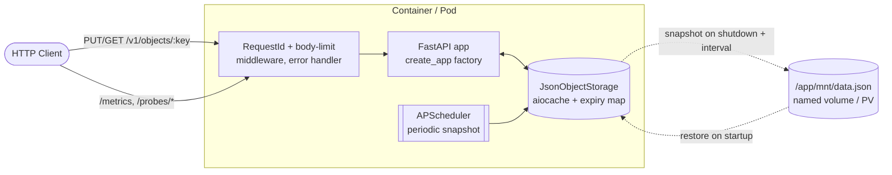

# JSON Object Storage Service

A small, production-styled HTTP service for storing JSON objects in memory with optional TTL, designed to run in Kubernetes. State survives pod restarts via an on-disk snapshot: written on shutdown and by a periodic background job, restored at startup.

[](https://github.com/MaxBarannikov/kubernetes-fastapi-service/actions/workflows/ci.yml)


## Features

- `PUT /v1/objects/{key}` / `GET /v1/objects/{key}` — write/read JSON with optional `expires` header (TTL in seconds)
- Payload limit enforced against the bytes that actually arrive, not just the declared `Content-Length`
- Unified error envelope — every error response is `{"error": {"code", "message", "request_id"}}`
- Per-request `X-Request-ID` (inbound or generated UUID) bound into every structlog line and echoed on the response
- Liveness / readiness probes for Kubernetes, where readiness actually checks the snapshot volume
- Prometheus metrics (`/metrics`, gated by the `ENABLE_METRICS` setting)
- Snapshot persistence — flushed on shutdown and on an interval, restored at startup, written atomically

## API

| Method | Path                 | Success | Errors                                                        |
| ------ | -------------------- | ------- | ------------------------------------------------------------- |
| `PUT`  | `/v1/objects/{key}`  | `201`   | `413` payload too large · `422` invalid key or `expires`       |
| `GET`  | `/v1/objects/{key}`  | `200`   | `404` missing or expired · `422` invalid key                   |
| `GET`  | `/probes/liveness`   | `200`   | —                                                             |
| `GET`  | `/probes/readiness`  | `200`   | `503` snapshot volume missing or read-only                    |
| `GET`  | `/metrics`           | `200`   | `404` when `ENABLE_METRICS=False`                             |

Keys match `^[A-Za-z0-9._:-]+$` and are capped at 256 characters; `expires` is an integer between 1 second and 1 year. Interactive docs live at `/docs`.

## Architecture



The app is built by a `create_app(*, settings, storage)` factory; the lifespan, probes, scheduler and body-size limit all bind to those instances rather than to module-level globals. Objects live in `aiocache.Cache(MEMORY)`, and the storage owns a parallel map of absolute expiry timestamps — aiocache exposes neither the live key set nor the TTLs, which is what makes that map necessary for snapshot/restore. On shutdown, and every `SNAPSHOT_INTERVAL_SECONDS`, the live entries are written to one JSON file; on startup it is loaded back and removed. Under Kubernetes that file lives on a `PersistentVolume`.

## Project layout

```
storage_service/
├── main.py              create_app factory + uvicorn entrypoint
├── api/                 routers, schemas, dependencies, middleware, error envelope
├── services/            JsonObjectStorage and the on-disk snapshot
├── settings/            pydantic-settings config, structlog setup, metrics, probes
├── tasks/               APScheduler wiring and the periodic snapshot job
└── tests/               pytest suite, one isolated app per test
k8s/                     kustomize-deployable manifests
.github/workflows/ci.yml lint · tests (3.12/3.13) · image build+scan · manifest validation
```

## Quick start

Requires [uv](https://docs.astral.sh/uv/) and Python 3.12+.

```bash
make install        # sync deps, install git hooks, create .env
make run            # run on http://localhost:8000
```

Run `make help` to list every target.

### Try it

```bash
# store an object with a 5-minute TTL
curl -X PUT http://localhost:8000/v1/objects/widget-42 \
     -H 'expires: 300' \
     -H 'Content-Type: application/json' \
     -d '{"name":"widget","qty":12}'

# read it back; X-Request-ID is propagated into logs and response headers
curl -i http://localhost:8000/v1/objects/widget-42 \
     -H 'X-Request-ID: demo-1'
```

A miss returns the unified envelope:

```json
{"error": {"code": "not_found", "message": "Object not found", "request_id": "demo-1"}}
```

## Running

| Method     | Command                | Notes                                              |
| ---------- | ---------------------- | -------------------------------------------------- |
| Local      | `make run`             | Set `SERVER_RELOAD=True` in `.env` for hot reload   |
| Docker     | `make up` / `make down`| Multi-stage image, runs as `uid 1001`               |
| Kubernetes | `make k8s-apply`       | `kubectl apply -k k8s`; NodePort on `:31001`        |

### Kubernetes

The manifests deploy as one kustomize bundle — Namespace, StorageClass, PV/PVC, ConfigMap, Deployment, Service and NetworkPolicies:

```bash
kubectl apply -k k8s
kubectl -n fastapi-storage-service get pvc   # expect STATUS=Bound
```

Two things need adapting to your cluster first:

1. **The node name.** `k8s/fastapi/pv.yaml` is a `local` volume pinned via `nodeAffinity` to `minikube`. Check `kubectl get nodes` and change it if yours differs (`kind-control-plane` on kind). The directory it points at must already exist on that node: `minikube ssh -- sudo mkdir -p /mnt/storage-service`.
2. **The image.** Build and push your own, then point kustomize at it without editing the Deployment:

```bash
docker build -t <your-registry>/storage-service:0.2.0 .
docker push  <your-registry>/storage-service:0.2.0
cd k8s && kustomize edit set image honeyleach/fastapi-storage-service=<your-registry>/storage-service:0.2.0
```

Validate the rendered manifests against the Kubernetes schema with `make k8s-lint` (needs [kubeconform](https://github.com/yannh/kubeconform)); CI does the same on every push.

## Configuration

All settings live in a single `pydantic_settings.BaseSettings` class (`storage_service/settings/core.py`) and are read from environment variables or `.env`. In Kubernetes they come from `k8s/fastapi/configmap.yaml`.

| Variable                    | Default                | Purpose                                                  |
| --------------------------- | ---------------------- | -------------------------------------------------------- |
| `SERVER_HOST`               | `0.0.0.0`              | uvicorn bind host                                        |
| `SERVER_PORT`               | `8000`                 | uvicorn bind port (validated `1..65535`)                 |
| `SERVER_RELOAD`             | `False`                | uvicorn auto-reload (local development only)             |
| `LOG_LEVEL_ROOT`            | `INFO`                 | Root logger level                                        |
| `ENABLE_METRICS`            | `True`                 | Mount Prometheus `/metrics`                              |
| `MAX_OBJECT_BYTES`          | `1048576` (1 MiB)      | Reject PUT bodies larger than this                       |
| `OBJECTS_DATA_PATH`         | `<repo>/mnt/data.json` | Snapshot file path (mounted on a PV in Kubernetes)       |
| `SNAPSHOT_INTERVAL_SECONDS` | `300`                  | Background snapshot interval; `0` disables the job       |

## Development

```bash
make test           # pytest with branch coverage (gate: 95%)
make lint           # every pre-commit hook: ruff, ruff-format, mypy, hygiene
make fmt            # apply ruff autofixes and formatting
```

The suite uses `pytest` + `pytest-asyncio`. Every test builds its own application through `create_app()` with its own `Settings`, its own `JsonObjectStorage` and a snapshot path under `tmp_path`; the `client` fixture enters `TestClient` as a context manager, so the lifespan and the snapshot round-trip actually run. To run a single test without the coverage gate:

```bash
uv run pytest storage_service/tests/test_api/test_objects.py::test_set_object --no-cov
```

## Tech stack

**Runtime** · Python 3.12 · FastAPI · uvicorn · pydantic-settings · aiocache · aiofiles · orjson · APScheduler · structlog · prometheus-fastapi-instrumentator · fastapi-healthchecks
**Tooling** · uv · ruff · mypy · pytest · pytest-asyncio · pytest-cov · pre-commit · hatchling
**Infra** · Docker (multi-stage, non-root, healthcheck) · Kubernetes (kustomize, PV/PVC, NetworkPolicy, securityContext, three probes) · GitHub Actions (lint, tests, Trivy scan, kubeconform)

## Design notes

- **App factory + DI all the way down.** Accepting an injected storage and then having the lifespan persist a module-level singleton is an easy mistake: it type-checks, the tests pass, and the wrong object gets snapshotted. `save_snapshot`/`restore_snapshot` take the storage and path as arguments so that cannot happen, and a test asserts it.
- **Expiry is a deadline, not a TTL.** Persisting the original TTL means an object written with `expires: 300` and snapshotted at second 290 returns with a fresh 300 seconds. Storing the absolute `expires_at` makes downtime count against the TTL.
- **The snapshot write is atomic.** Writing in place truncates first, so a crash mid-write destroys the previous good state. The payload goes to a temp file, is `fsync`ed, then `os.replace`d.
- **An empty storage still writes a snapshot.** Skipping the write leaves a stale file behind, and the next startup resurrects objects that were deliberately dropped.
- **A corrupt snapshot must not restart-loop the pod.** Unparsable files are logged and left on disk for inspection; broken entries inside a valid file are skipped so the good ones still load.
- **The body limit is enforced on the wire.** `Content-Length` is the client's word, and a chunked request declares none. The middleware counts arriving bytes; the header check remains as a fast path.
- **In-memory cache, not Redis.** The brief is objects in RAM with optional TTL. Redis would add a dependency without changing the semantics.
- **The scheduler runs in-process.** Its job snapshots in-memory storage, which a separate process could not reach. It exists to bound data loss on `SIGKILL`, where the shutdown hook never runs.
- **`Recreate`, not `RollingUpdate`.** The snapshot sits on a `ReadWriteOnce` volume, so a new pod cannot attach it while the old one holds it.
- **No `PodDisruptionBudget`.** At one replica a PDB either blocks node drains or permits everything. The snapshot is what makes disruption survivable.

## Limitations

Deliberate scope limits for a demo service:

- **No authentication.** Anyone who can reach the port can read and write every key.
- **No horizontal scaling.** Objects live in one process's memory behind a `ReadWriteOnce` volume; a second replica would serve a different dataset.
- **No eviction policy.** Storage grows until the pod hits its memory limit.
- **`/metrics` is unauthenticated** and served on the API's port.
